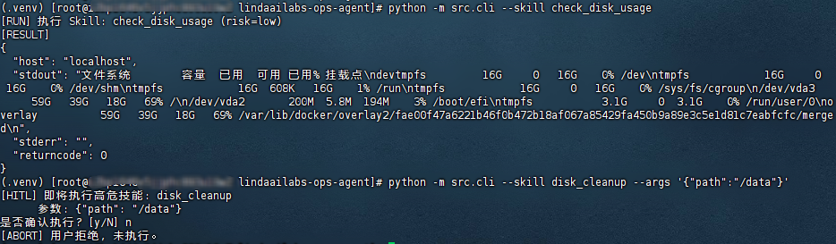

# lindaailabs-ops-agent

基于 **LangGraph + HITL + 动态 Skill** 的 Linux 运维 Agent（Phase 1 MVP）。

## 核心特性（Phase 1）
- **安全可控**：仅「高危 + 自动触发(`mode=automated`)」经 `interrupt()` 挂起，人工审批（`Command(resume=...)`）后才执行；人工对话 / 手动 CLI 触发视为已授权，直接执行不二次拦截。
- **动态 Skill**：从独立 `skills` 仓库扫描加载，无需重启。目录优先级：`SKILL_DIR` 环境变量 > `config/settings.yaml` 的 `skill_dir` > 默认 `./skills`（均支持 `${ENV_VAR}` 与 `~` 展开）。
- **多模型路由**：`config/settings.yaml` 维护模型池，按 `use_case` 实例化（凭证走 `${ENV}`，禁硬编码）。
- **FastAPI 入口**：`/chat` 发起任务、`/resume` 通用恢复（澄清/审批）、`/approve` 审批快捷、`/reload_skills` 热加载。
- **多轮交互**：Skill 的 `required_args` 缺失时，`clarify` 节点 `interrupt()` 反问收集；低风险一步直达，高危走「澄清 → 审批 → 执行」。
- **手动触发 CLI**：`python -m src.cli --skill <name>` 绕过 LLM 规划器直接执行（不依赖 `OPENAI_API_KEY`，高危需 `--yes` 或交互确认）。

## 目录结构
```
config/settings.yaml      # 全局配置（模型、skill_dir、checkpoint、approval）
src/
  graph/                  # state / nodes(含 interrupt) / workflow
  loader/skill_loader.py  # importlib 动态加载 + frontmatter 解析
  executor/               # Executor 抽象 + LocalExecutor（预留 SSH）
  models/router.py        # 多模型路由
  api/                    # FastAPI 服务
tests/                    # Skill 加载 & HITL 链路测试
```

## 快速开始
```bash
python -m venv .venv
# Linux/macOS
source .venv/bin/activate
# Windows PowerShell
# .\.venv\Scripts\Activate.ps1
pip install -r requirements.txt
cp .env.example .env      # 填入 OPENAI_API_KEY
python -m src.main        # 启动 :8000
```

## Skill 目录配置
本地 Skill 目录（指向独立 `skills` 仓库）按以下优先级解析，越靠前优先级越高：
1. 环境变量 `SKILL_DIR`（生产推荐，便于零改动切换环境）；
2. `config/settings.yaml` 的 `skill_dir` 字段；
3. 默认值 `./skills`。

以上取值均支持 `${ENV_VAR}` 与 `~` 展开；相对路径按 `ops-agent` 项目根解析。默认配置假设两个仓库是兄弟目录：

```text
workspace/
  lindaailabs-ops-agent/
  lindaailabs-skills/
```

示例：
```bash
# Linux
export SKILL_DIR=~/lindaailabs-skills
# 或任意绝对路径
export SKILL_DIR=/opt/lindaailabs-skills
python -m src.main
```

## 红线（见需求文档 §6）
1. 禁止硬编码凭证（仅 `settings.yaml` / 环境变量）。
2. 禁止跳过 Checkpointer（HITL 持久化底线，使用 SqliteSaver）。
3. 禁止在 `interrupt()` 之前执行副作用（Shell/写库/发请求必须在 resume 之后）。
4. 禁止 `eval()`/`exec()` 加载 Skill（仅 `importlib` + frontmatter 安全解析）。

## 模型配置（config/settings.yaml）
模型不在代码里写死，统一在 `config/settings.yaml` 的 `models:` 列表维护，运行时由 `ModelRouter` 按 `use_case` 选择并实例化（凭证用 `${ENV_VAR}` 占位，由 python-dotenv 解析，禁止硬编码明文）。

```yaml
models:
  - name: "qwen-turbo"
    type: "openai"
    api_key: "${OPENAI_API_KEY}"
    base_url: "https://dashscope.aliyuncs.com/compatible-mode/v1"
    use_case: "simple_task"        # 简单任务路由到此模型
  - name: "gpt-4o"
    type: "openai"
    api_key: "${OPENAI_API_KEY}"
    base_url: "https://api.openai.com/v1"
    use_case: "complex_reasoning"  # 复杂推理（如规划器选 Skill）路由到此模型
```

- 切换/新增模型：在 `models:` 下加一项，填 `name` / `type` / `api_key` / `base_url` / `use_case`，无需改代码。
- `use_case` 是路由键：规划器（`planner` 节点）固定使用 `complex_reasoning`；其余能力可按需在 `router.get(use_case=...)` 调用时指定。
- 凭证只走 `${ENV_VAR}` + `.env`：复制 `.env.example` 为 `.env` 填 `OPENAI_API_KEY` 即可，`.env` 已被 `.gitignore` 忽略。

## 路由约定
- 规划器（LLM 工具路由）：Skill 的 `SKILL.md` frontmatter 转成 tool schema，由 ChatModel 选择；tool 参数由该 Skill 的 `required_args` + `host` 动态生成。
- 风险分级：`risk` 由 Skill 静态声明（`low`/`high`）；**审批闸门 = `risk:high` 且 `mode:automated`**（人工对话 / 手动 CLI 为 `interactive`，不审批）。
- **多轮澄清（全程 LLM 意图识别）**：Skill 声明 `required_args`（如 `disk_cleanup` 的 `path`）。若规划器未带齐，`clarify` 节点 `interrupt()` 抛出 `clarification_request` 反问；用户经 `/resume` 用**自然语言**回复（如"就是 /data 那个盘"），由 LLM（`simple_task` 模型）从回复中抽取出结构化参数，规则解析仅作兜底。该机制与风险等级解耦——低风险技能缺参数也会先澄清，但不触发审批。
- **使用者不懂系统，只能说大白话（这是能力需求，不是限制规则）**：使用者通常并不知道本 Agent 有哪些 `Skill`、要传什么参数、命令长什么样，所以他唯一能做的就是用自然语言描述诉求。入口（首轮 `planner` 与多轮 `clarify`）统一经 LLM 把"大白话"翻译成 Skill 声明的结构化参数。当用户的问法超出已注册能力、无法命中任何 Skill 时，`planner` 不报错死路，而是用 LLM 友好地说明"我能做什么、建议你怎么问"，帮助使用者把模糊诉求收敛到可执行操作。JSON 回复会被过滤为仅 Skill 声明的 `required_args`（+`host`），杜绝任意字段注入。
- 执行后端：Skill 通过 `get_executor().run(cmd)` 执行，local/ssh 零侵入切换。

## 审核触发规则与运维场景
**审核闸门 = `risk: high` 且处于「自动触发(`mode=automated`)」模式。**

核心原则：**人类是否在决策现场**。人工对话 / 手动 CLI 触发时人类就在场，其显式请求即视为授权，无需二次拦截；只有无人值守的定时 / 自动触发，才需要额外的人工审批闸门。

| 触发方式 | 简单（`low`） | 复杂（`high`） | 是否进审核节点 |
|---|---|---|---|
| 人工对话 `/chat`（默认 `interactive`） | 直执行 | 直执行（人类已授权） | ❌ |
| 定时任务 / 自动触发（`mode=automated`） | 直执行 | 挂起 `approval_request`，需 `/approve` 放行 | ✅ |
| 手动 CLI（终端，人类在场） | 直执行 | 交互确认 / `--yes` 后执行 | ❌（终端即授权） |

要点：
- **自动触发（定时任务等）**：`high` 技能先 `interrupt()` 挂起，返回 `pending_approval`，由人工经 `/approve` 或 `/resume` 放行后才产生副作用。
- **人工对话 / 手动 CLI**：即使 `high` 也直接执行（对话里一句话、或 CLI 手动敲命令即代表已授权）。CLI 仍保留 `--yes`/交互确认作为终端内的二次确认，但不走 `interrupt()` 审批节点。
- 切换触发模式：`/chat` 默认 `interactive`；定时任务调用时显式传 `"mode": "automated"` 即可启用审批闸门。

### 日常运维场景示例
**简单（任何方式都不触发审核，一步直达）：**
- "查下 web-01 的磁盘使用率" → `check_disk_usage`（`low`），对话 / 定时均直接返回 `df -h`。
- 定时巡检：每 5 分钟 `python -m src.cli --skill check_disk_usage`，静默直执行、无需审批。

**复杂（仅自动触发才需审批，人工对话 / CLI 直执行）：**
- 人工说"清理 /data 下 30 天前的日志" → 对话交互中直接执行 `disk_cleanup`（`high`），不挂审批。
- 定时任务触发 `disk_cleanup` → 挂起 `pending_approval`，值班人员 `/approve` 后才执行。
- "重启 nginx" / 批量删表 / kill 进程 / 改防火墙 → 均声明 `risk: high`；自动触发走审批，人工触发直执行。

> 注意：多轮澄清（缺参数反问）与审核是两套独立机制。自动触发且缺必填参数时，会先「澄清 → 再审批 → 执行」；人工对话缺参数只澄清、不审批。

## 多轮对话示例（HTTP）
```bash
# 1) 用户说"清理磁盘"但未给路径 -> 触发澄清中断
curl -X POST localhost:8000/chat -H 'Content-Type: application/json' \
  -d '{"message":"清理一下磁盘","thread_id":"t1"}'
# -> {"status":"pending_clarification","clarification_request":{"type":"clarification_request","missing":["path"],...}}

# 2) 用户回复路径 -> 进入高危审批中断
curl -X POST localhost:8000/resume -H 'Content-Type: application/json' \
  -d '{"thread_id":"t1","response":"/data"}'
# -> {"status":"pending_approval",...}

# 3) 审批通过 -> 执行
curl -X POST localhost:8000/approve -H 'Content-Type: application/json' \
  -d '{"thread_id":"t1","approved":true,"comment":"同意"}'
# -> {"status":"done","answer":"[disk_cleanup] 执行完成：..."}
```

## 测试
```bash
python -m pytest
python -m mypy src
```

## 手动触发（绕过 LLM，无需 API Key）
```bash
python -m src.cli --skill check_disk_usage
python -m src.cli --skill disk_cleanup --args '{"path":"/tmp"}' --yes
```

## 服务器实测示例

在 Linux 测试服务器上，项目以源码形式直接运行（无需编译、无需打包），CLI 实测效果如下：

```bash
python -m src.cli --skill check_disk_usage
python -m src.cli --skill disk_cleanup --args '{"path":"/data"}'
```



- `check_disk_usage`（`risk=low`）直接执行并返回 `df -h` 结果；
- `disk_cleanup`（`risk=high`）在终端内弹出 `[HITL]` 二次确认，输入 `n` 后执行中止，符合"人类在场授权"设计。

即：`low` 技能一步直达，`high` 技能即使 CLI 触发也会在执行前要求确认，确认后才会产生副作用。
